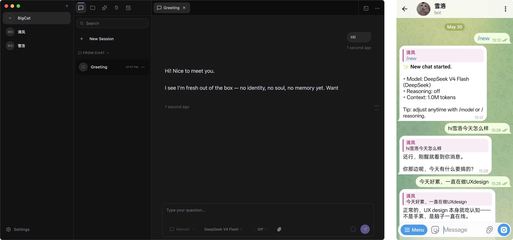

<div align="right">
  <span>[<a href="./README.md">English</a>]<span>
  </span>[<a href="./README_CN.md">简体中文</a>]</span>
</div>  

<div align="center">
  
  <h1>Memoh</h1>
  <p>The open-source multi-agent platform.<br>
  Every agent gets its own computer, desktop, network, and long-term memory.</p>
  <div align="center">
    
    
    
    <a href="https://deepwiki.com/memohai/Memoh">
      
    </a>
    <a href="https://t.me/memohai">
      
    </a>
  </div>
  <h3>
    <a href="https://memoh.ai/desktop">Download Memoh Desktop</a> · <a href="#deploy-to-server">Deploy to Server</a> · <a href="https://memoh.ai">Website</a> · <a href="https://x.com/memoh_ai">X</a> · <a href="https://docs.memoh.ai">Docs</a>
  </h3>
  
</div>

## What is Memoh?

Memoh lets you run multiple AI agents on a single machine. Each agent gets its own container, filesystem, desktop, browser, network, and long-term memory — like a real computer that belongs to it.

Talk to them through Telegram, Discord, Lark, WeChat, Web UI, and more. They remember context, drive a browser, call MCP tools, and run scheduled tasks.

Run one for yourself, assign one to each team member, or spin up a fleet of dedicated agents on a single machine.

## Quick Start

### Desktop

[Download Memoh Desktop](https://memoh.ai/desktop)

### Deploy to Server

```bash
curl -fsSL https://memoh.sh | sh
```

<details>
<summary><strong>More deployment options</strong></summary>

Manual deployment:

```bash
git clone --depth 1 https://github.com/memohai/Memoh.git
cd Memoh
cp conf/app.docker.toml config.toml
# Edit config.toml
docker compose up -d
```

> **Use CN mirror for slow image pulls:**
> ```bash
> curl -fsSL https://memoh.sh | USE_CN_MIRROR=true sh
> ```
>
> Do not run the whole installer with `sudo`. The installer will use `sudo docker`
> internally if Docker requires it.

See [DEPLOYMENT.md](DEPLOYMENT.md) for custom configuration and production setup.

</details>

## Why Memoh?

- **Every agent gets its own computer**: An isolated container with its own filesystem, network, desktop, and browser.
- **Multi-user, multi-bot**: Run one for yourself, deploy one for each family member, run a fleet on a single machine.
- **Lightweight**: Runs on edge devices. Inference in the cloud, data stays local.

## Features

### Core

- **Multi-bot & multi-user**: Multiple bots that chat privately, in groups, or with each other. Cross-platform identity binding.
- **Containerized workspaces**: Each bot runs in its own container with a dedicated filesystem, network, tools, and desktop.
- **Built-in memory**: Long-term memory across sessions and platforms, out of the box. Also supports [Mem0](https://mem0.ai), OpenViking.
- **10+ channels**: Telegram, Discord, Lark, WeChat, QQ, Email, and more.

### Agent Capabilities

- **MCP**: Connect external tool servers. Each bot manages its own connections.
- **Browser Use**: Drive a browser inside the container.
- **Computer Use**: Operate the container desktop for GUI workflows.
- **Skills & Supermarket**: Modular skills, install curated templates from Supermarket, delegate to sub-agents.
- **Automation**: Scheduled tasks and periodic heartbeat.

## Memory

Ships with a fully self-hosted memory engine. Every bot remembers what you've told it across sessions, days, and platforms.

Also supports [**Mem0**](https://mem0.ai) and **OpenViking** as drop-in alternatives. See the [documentation](https://docs.memoh.ai/memory-providers/).

## Sub-projects

- [**Twilight AI**](https://github.com/memohai/twilight-ai) — A lightweight, idiomatic AI SDK for Go, inspired by [Vercel AI SDK](https://sdk.vercel.ai/). Provider-agnostic (OpenAI, Anthropic, Google), with first-class streaming, tool calling, MCP, and embeddings.

## Project Status

    

## Star History

[](https://www.star-history.com/#memohai/Memoh&type=date&legend=top-left)

## Contributors

<a href="https://github.com/memohai/Memoh/graphs/contributors">
  
</a>

## Community

- 🌐 [**Website**](https://memoh.ai)
- 📚 [**Documentation**](https://docs.memoh.ai)
- 💬 [**Telegram Group**](https://t.me/memohai)
- 🛒 [**Supermarket**](https://github.com/memohai/supermarket)
- 🤝 [**Cooperation**](mailto:business@memoh.net) — business@memoh.net

---

**LICENSE**: AGPLv3

Made with ❤️ by MemohAI Team,

Copyright (C) 2026 MemohAI (memoh.ai). All rights reserved.
